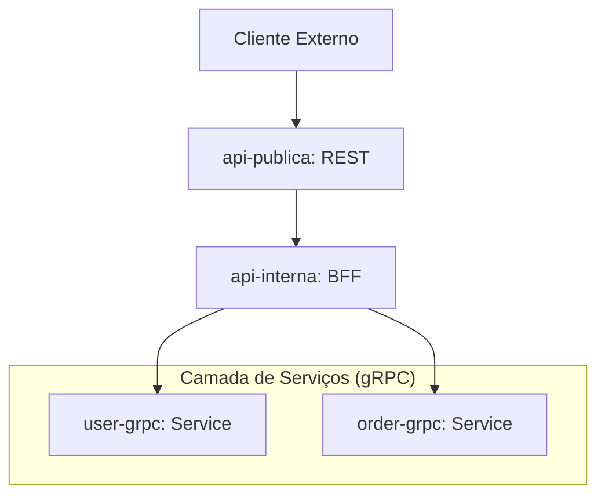

# DCM - Docker Compose Manager

Gerencie múltiplos serviços Docker com **um único comando**.

## O Problema

```bash
# ❌ Sem DCM: Múltiplos terminais
Terminal 1: cd services/service-a && docker-compose up
Terminal 2: cd services/service-b && docker-compose up
Terminal 3: cd services/service-c && docker-compose up
# ... e assim vai
```

## A Solução

```bash
# ✅ Com DCM: Um comando
dcm up dev
```

## Características

- 🚀 **Comando único** - Inicie todos os serviços de uma vez
- ⚡ **Concorrência** - Inicialização paralela de serviços (super rápido!)
- 📦 **Sem dependências** - Binário standalone
- 🎯 **Grupos** - Organize serviços em combinações
- 🖥️ **Cross-platform** - Linux, macOS, Windows

## Instalação

### Passo a Passo

1. **Baixar o DCM**
   ```bash
   # Acesse: https://github.com/Disneyjr/dcm/releases
   # Baixe o binário para o seu sistema operacional
   ```

2. **Executar o Instalador como Administrador**
   
   **Windows:**
   - Clique com o botão direito em `install.exe`
   - Selecione "Executar como administrador"
   - Aguarde a confirmação de instalação bem-sucedida
   
   **Linux/macOS:**
   ```bash
   chmod +x install
   sudo ./install
   ```

3. **Verificar a Instalação**
   ```bash
   dcm version
   ```

4. **Inicializar seu Workspace**
   
   Navegue até a pasta raiz dos seus projetos:
   ```bash
   cd /caminho/raiz/dos/projetos/
   dcm init
   ```

5. **Validar a Configuração**
   ```bash
   dcm validate
   ```

### Desinstalar

Para remover o DCM do sistema:

**Windows:**
- Clique com o botão direito em `uninstall.exe`
- Selecione "Executar como administrador"

**Linux/macOS:**
```bash
sudo ./uninstall
```

---

### Configurar

Navegue até a pasta raiz do seu projeto e execute:

```bash
dcm init
```

Isso criará um `workspace.json`. Veja um exemplo de arquitetura de microserviços:

```json
{
  "version": "1.0",
  "projects": {
    "api-publica": {
      "path": "./api-publica",
      "description": "API pública REST (gateway externo)"
    },
    "api-interna": {
      "path": "./api-interna",
      "description": "API interna / BFF que fala com gRPC"
    },
    "user-grpc": {
      "path": "./user-grpc",
      "description": "Serviço gRPC de usuários"
    },
    "order-grpc": {
      "path": "./order-grpc",
      "description": "Serviço gRPC de pedidos"
    }
  },
  "groups": {
    "order": {
      "description": "Fluxo de pedido usando todas as camadas (pública + interna + user-grpc + order-grpc)",
      "services": [
        "api-publica",
        "api-interna",
        "user-grpc",
        "order-grpc"
      ]
    },
    "user": {
      "description": "Fluxo simplificado usando apenas api-publica, api-interna e user-grpc (sem pedidos)",
      "services": [
        "api-publica",
        "api-interna",
        "user-grpc"
      ]
    }
  }
}
```

## Arquitetura do Projeto de Exemplo

A estrutura de pastas e o fluxo de comunicação seguem o padrão de microserviços, onde uma API pública atua como gateway para uma API interna (BFF), que por sua vez se comunica com serviços gRPC especializados.

### Estrutura de Pastas

```text
Projects/
├── api-interna/
├── api-publica/
├── order-grpc/
└── user-grpc/
```

### Fluxo de Comunicação



> [!TIP]
> Use `"parallel": false` nos grupos quando a ordem de inicialização importar (ex: subir os serviços gRPC antes das APIs).

### 3. Usar


```bash
dcm init           # Cria configuração inicial
dcm validate       # Valida o workspace.json
dcm list           # Ver projetos e grupos
dcm up dev         # Iniciar grupo completo
dcm down           # Parar tudo
dcm down dev       # Parar apenas o grupo 'dev'
dcm down -v        # Parar tudo e remover volumes
dcm down dev -v    # Parar grupo 'dev' e remover volumes
```

## Comandos Disponíveis

### Gerenciamento de Serviços

**Iniciar serviços:**
```bash
dcm up dev          # Todos os serviços do grupo 'dev'
dcm up dev --build  # Força o rebuild das imagens
```

**Parar serviços:**
```bash
dcm down            # Para todos os serviços
dcm down dev        # Para apenas o grupo 'dev'
dcm down -v         # Para todos e remove volumes
dcm down dev -v     # Para grupo 'dev' e remove volumes
```

**Outras operações:**
```bash
dcm restart         # Reiniciar todos os serviços
dcm logs            # Ver logs de todos os serviços
dcm status          # Status dos containers
dcm inspect dev     # Inspecionar configuração do grupo
```

## Exemplos Práticos

**Desenvolvimento local:**
```bash
# Iniciar apenas o que você precisa
dcm up backend

# Parar e limpar tudo quando terminar
dcm down -v
```

**Testar um grupo específico:**
```bash
# Subir grupo de testes
dcm up test --build

# Parar apenas esse grupo
dcm down test
```

## Contribuindo

1. Fork o repositório
2. Crie uma branch: `git checkout -b feature/minha-feature`
3. Faça seus commits: `git commit -m "feat: descrição"`
4. Push: `git push origin feature/minha-feature`
5. Abra um Pull Request

## Licença

MIT - Use livremente!

## Suporte

Dúvidas ou problemas? Abra uma [issue](https://github.com/Disneyjr/dcm/issues) 🚀